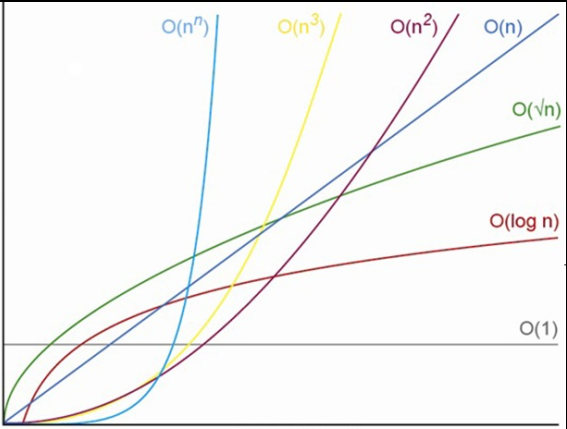

<a name="readme-topo"></a>

<div align='center'>
  
</div>

<h1 align='center'>
  Algoritmos MinMax
</h1>

<div align='center'>

[![IDE][vscode-badge]][vscode-url]
[![Make][make-badge]][make-url]
[![Linguagem][cpp-badge]][cpp-url]

Algoritmos e Estruturas de Dados I

</div>

<details>
  <summary>
  <b style='font-size: 15px'>
    📑 Sumário
  </b>
  </summary>
  <ol>
    <li><a href="#-Introdução">🔍 Introdução</a></li>
    <li>
      <a href="#-Fundamentação-Teórica">💡 Fundamentação Teórica</a>  
    </li>
    <li><a href="#-Objetivos">🎯 Objetivos</a></li>
    <li>
      <a href="#-Metodologia">🔬 Metodologia</a>
      <ul>
        <li><a href='#Arquivos'>Arquivos</a></li>
        <li><a href='#Bibliotecas'>Bibliotecas</a></li>
        <li><a href='#Funções'>Funções</a></li>
        <li><a href='#Detalhes-de-Implementação'>Detalhes de Implementação</a></li>
      </ul>
    </li>
    <li>
      <a href="#-Testes-e-Resultados-Esperados">📊 Testes e Resultados Esperados</a>
    </li>
    <li><a href="#-Conclusão">🏁 Conclusão</a></li>
    <li>
      <a href="#-Começando">🔨 Começando</a>
      <ul>
        <li><a href="#Pré-requisitos">Pré-requisitos</a></li>
        <li><a href="#Instalando">Instalando</a></li>
      </ul>
    </li>
    <li><a href="#-Ambiente-de-Compilação-e-Execução">🧪 Ambiente de Compilação e Execução</a></li>
    <li><a href="#-Referências">📚 Referências</a></li>
    <li><a href="#-Contato">📨 Contato</a></li>
  </ol>
</details>


## 🔍 Introdução

<div align="justify">

Este [trabalho][trabalho-url] (Algoritmos MinMax) foi proposto na disciplina de Algoritmos e Estruturas de Dados I (AEDSI) pelo professor [Michel Pires da Silva][github-prof].

Simplificadamente, o trabalho consiste na avaliação de três tipos de algoritmos que são capazes de achar o menor e o maior valores de um vetor de n posições.

</div>

<p align="right">(<a href="#readme-topo">voltar ao topo</a>)</p>

## 💡 Fundamentação Teórica

<div align='justify'>

</div>

<p align="right">(<a href="#readme-topo">voltar ao topo</a>)</p>

## 🎯 Objetivos

<div align="justify">

</div>

<p align="right">(<a href="#readme-topo">voltar ao topo</a>)</p>

## 🔬 Metodologia

### Arquivos

<div align="justify">

Para a solução proposta os seguintes diretórios/arquivos foram utilizados: 

  - [`output/csv/medias.csv`][medias-ref]: arquivo em que se encontra os resultados de saída do programa em CSV obtidos em testes no _notebook_;
  - [`output/csv/mediasPC.csv`][mediasPC-ref]: arquivo em que se encontra os resultados de saída do programa em CSV obtidos em testes no _desktop_;
  - [`output/img/graficoComparacaoAlgoritmosPorOrdem.png`][graficoAO-ref]: arquivo em que se encontra os gráficos de comparação entre os algoritmos por ordem, plotados com gnuplot no _notebook_;
  - [`output/img/graficoComparacaoOrdensPorAlgoritmo.png`][graficoOA-ref]: arquivo em que se encontra os gráficos de comparação entre as execuções por ordens diferentes do mesmo algoritmo, plotados com gnuplot no _notebook_;
  - [`output/img/graficoComparacaoAlgoritmosPorOrdemPC.png`][graficoAOPC-ref]: arquivo em que se encontra os gráficos de comparação entre os algoritmos por ordem, plotados com gnuplot no _desktop_;
  - [`output/img/graficoComparacaoOrdensPorAlgoritmoPC.png`][graficoOAPC-ref]: arquivo em que se encontra os gráficos de comparação entre as execuções por ordens diferentes do mesmo algoritmo, plotados com gnuplot no _desktop_;
  - [`src/main.cpp`][main-ref]: arquivo em que se encontra a função `main()` que executa comandos cruciais do programa;
  - [`src/minMax.hpp`][hppJV-ref]: arquivo em que se encontra as assinaturas das funções utilizadas e importações de bibliotecas padrão;
  - [`src/minMax.cpp`][cppJV-ref]: arquivo em que se encontra as implementações das funções utilizadas;
  - [`makefile`][makefile]: arquivo com os comandos para a compilação e execução do programa.

### Bibliotecas

A seguir estão as bibliotecas incluídas no programa e que são essenciais para o funcionamento dele.

  - `"minMax.hpp"`: biblioteca criada pelo autor com funções essenciais para o programa;
  - `<iostream>`[^3]: biblioteca utilizada para as operações de entrada e saída;
  - `<fstream>`[^3]: biblioteca utilizada para manipular a escrita nos arquivos [`output/csv/medias.csv`][medias-ref] e [`output/csv/mediasPC.csv`][mediasPC-ref];
  - `<random>`[^3]: biblioteca utilizada para gerar os números aleatórios para preencher os vetores de entrada para os algoritmos;
  - `<chrono>`[^3]: biblioteca utilizada para calcular, em ms, o tempo de execução de cada algoritmo MinMax;
  - `<string>`[^3]: biblioteca utilizada para utilizar o tipo de variável _string_, para facilitar a geração de resultados nos arquivos de saída.

### Funções

<!-- TODO -->

Abaixo estão as funções essenciais para o funcionamento do programa. Com a finalidade de simplificar a escrita, os parâmetros de cada uma delas foram ocultados.

  - `int main()`: função principal do programa que cria variáveis e faz chamadas de funções importantes para o programa;

### Detalhes de Implementação

<!-- TODO -->

</div>

<p align="right">(<a href="#readme-topo">voltar ao topo</a>)</p>

## 📊 Testes e Resultados Esperados

<div  align="justify">

<!-- TODO -->

</div>

<p align="right">(<a href="#readme-topo">voltar ao topo</a>)</p>

## 🏁 Conclusão

<div  align="justify">

<!-- TODO -->

</div>

<p align="right">(<a href="#readme-topo">voltar ao topo</a>)</p>

## 🔨 Começando

Nesta seção estão exemplificados os meios através dos quais se tornam possíveis a compilação e execução do programa apresentado.

### Pré-requisitos

Inicialmente, algumas considerações importantes sobre como se deve preparar o ambiente para compilar e executar o programa:

> [!NOTE]
> Recomenda-se usar uma distribuição de sistema operacional Linux ou o Windows Subsystem for Linux (WSL), pois os comandos no [`makefile`][makefile] foram selecionados para funcionar em um ambiente [_shell/bash_][bash-url].

Considerando um ambiente _shell_, garanta que os seguintes comandos já foram executados:
  - Atualize os pacotes antes da instalação dos compiladores:
  ```console
  sudo apt update
  ```
  - Instale a coleção de compiladores ___GNU/g++___ e o ___make___:
  ```console
  sudo apt install build-essential
  ```
  - Se necessário, instale o ___make___ individualmente:
  ```console
  sudo apt install make
  ```

### Instalando

Com o ambiente preparado, os seguintes passos são para a instalação, compilação e execução do programa localmente:

1. Clone a _branch_ [`AlgoritmosMinMax`][branchAMM-url] do repositório no diretório desejado:
  ```console
  git clone -b AlgoritmosMinMax https://github.com/alvarengazv/trabalhosAEDS1.git
  ```
2. Compile o programa com o ___make___, o que gera a pasta `build`, que contém arquivos de objeto e um arquivo executável:
  ```console
  make
  ```
3. Execute o programa da pasta `build` após a compilação:
  ```console
  make run
  ```
4. Se necessário, apague a última compilação da pasta `build`:
  ```console
  make clean
  ```

O programa estará pronto para ser testado.

<p align="right">(<a href="#readme-topo">voltar ao topo</a>)</p>

## 🧪 Ambiente de Compilação e Execução

> [!IMPORTANT] 
> Para que os testes tenham validade, considere as especificações técnicas dos computadores utilizados

O trabalho foi desenvolvido, compilado e executado em dois ambiente distintos, cada um com as configurações especificadas em cada quadro:

<div align='center'>

![Ubuntu][ubuntu-badge]
![Ryzen][ryzen5500-badge]
![Lenovo][lenovo-badge]

SO | Compilador | CPU | RAM
--- | --- | --- | ---
Ubuntu 22.04.4 LTS | g++ (Ubuntu 11.4.0-1ubuntu1~22.04) 11.4.0 | Ryzen 5 5500U 2.1GHz | 2x4GB 3200MHz

</div>

<div align='center'>

![Windows][windows-badge]
![Ryzen][ryzen3500-badge]

SO | Compilador | CPU | RAM
--- | --- | --- | ---
Windows 10 - Version 22H2 - OS Build 19045.4170 | Microsoft (R) C/C++ Optimizing Compiler Version 19.39.33523 for x86 | Ryzen 5 3500X 4.05GHz | 2x8GB 3200MHz

</div>

<p align="right">(<a href="#readme-topo">voltar ao topo</a>)</p>

## 📚 Referências

C++ Reference. **CPPReference**, 2017. Disponível em: https://en.cppreference.com/w/cpp. Acesso em: 29 mar. 2024.

<p align="right">(<a href="#readme-topo">voltar ao topo</a>)</p>

## 📨 Contato

<div align="center">
   <i>Guilherme Alvarenga de Azevedo - 3º Período de Engenharia de Computação @ CEFET-MG</i>
<br><br>

[![Gmail][gmail-badge]][gmail-autor]
[![Linkedin][linkedin-badge]][linkedin-autor]
[![Telegram][telegram-badge]][telegram-autor]
</div>

<p align="right">(<a href="#readme-topo">voltar ao topo</a>)</p>

[^3]: C++ Reference. **CPPReference**, 2017. Disponível em: https://en.cppreference.com/w/cpp. Acesso em: 29 mar. 2024.


[vscode-badge]: https://img.shields.io/badge/Visual%20Studio%20Code-0078d7.svg?style=for-the-badge&logo=visual-studio-code&logoColor=white
[vscode-url]: https://code.visualstudio.com/docs/?dv=linux64_deb
[make-badge]: https://img.shields.io/badge/_-MAKEFILE-427819.svg?style=for-the-badge
[make-url]: https://www.gnu.org/software/make/manual/make.html
[cpp-badge]: https://img.shields.io/badge/c++-%2300599C.svg?style=for-the-badge&logo=c%2B%2B&logoColor=white
[cpp-url]: https://en.cppreference.com/w/cpp
[trabalho-url]: https://drive.google.com/file/d/1m3pVwTmCQPWp7HDzCqwcy_aB0x4A3yIx/view?usp=sharing
[github-prof]: https://github.com/mpiress
[medias-ref]: output/csv/medias.csv
[mediasPC-ref]: output/csv/mediasPC.csv
[graficoAO-ref]: output/img/graficoComparacaoAlgoritmosPorOrdem.png
[graficoOA-ref]: output/img/graficoComparacaoOrdensPorAlgoritmo.png
[graficoAOPC-ref]: output/img/graficoComparacaoAlgoritmosPorOrdemPC.png
[graficoOAPC-ref]: output/img/graficoComparacaoOrdensPorAlgoritmoPC.png
[main-ref]: src/main.cpp
[hppJV-ref]: src/minMax.hpp
[cppJV-ref]: src/minMax.cpp
[branchAMM-url]: https://github.com/alvarengazv/trabalhosAEDS1/tree/AlgoritmosMinMax
[makefile]: ./makefile
[bash-url]: https://www.hostgator.com.br/blog/o-que-e-bash/
[lenovo-badge]: https://img.shields.io/badge/lenovo%20laptop-E2231A?style=for-the-badge&logo=lenovo&logoColor=white
[ubuntu-badge]: https://img.shields.io/badge/Ubuntu-E95420?style=for-the-badge&logo=ubuntu&logoColor=white
[ryzen5500-badge]: https://img.shields.io/badge/AMD%20Ryzen_5_5500U-ED1C24?style=for-the-badge&logo=amd&logoColor=white
[ryzen3500-badge]: https://img.shields.io/badge/AMD%20Ryzen_5_3500X-ED1C24?style=for-the-badge&logo=amd&logoColor=white
[windows-badge]: https://img.shields.io/badge/Windows-0078D6?style=for-the-badge&logo=windows&logoColor=white
[linkedin-badge]: https://img.shields.io/badge/-LinkedIn-0077B5?style=for-the-badge&logo=Linkedin&logoColor=white
[linkedin-autor]: https://www.linkedin.com/in/guilherme-alvarenga-de-azevedo-959474201/
[telegram-badge]: https://img.shields.io/badge/Telegram-2CA5E0?style=for-the-badge&logo=telegram&logoColor=white
[telegram-autor]: https://t.me/alvarengazv
[gmail-badge]: https://img.shields.io/badge/-Gmail-D14836?style=for-the-badge&logo=Gmail&logoColor=white
[gmail-autor]: mailto:gui.alvarengas234@gmail.com
