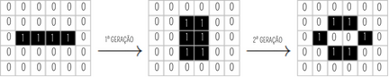

  

<h1 align='center'>
  Jogo da Vida
</h1>

[![IDE][vscode-badge]][vscode-url]
[![Make][make-badge]][make-url]
[![Linguagem][cpp-badge]][cpp-url]

Algoritmos e Estruturas de Dados I

  

  <b style='font-size: 15px'>
    Índice
  </b>
  

  <ol>
    <li><a href="#Introdução">Introdução</a></li>
    <li><a href="#Fundamentação-Teórica">Fundamentação Teórica</a></li>
    <li><a href="#Objetivos">Objetivos</a></li>
    <li><a href="#Metodologia">Metodologia</a></li>
    <li>
      <a href="#Testando">Testando</a>
      <ul>
        <li><a href="#Pré-requisitos">Pré-requisitos</a></li>
        <li><a href="#Instalação-e-Execução">Instalação e Execução</a></li>
      </ul>
    </li>
    <li><a href="#Conclusão">Conclusão</a></li>
    <li><a href="#Ambiente-de-Compilação">Ambiente de Compilação</a></li>
    <li><a href="#Referências">Referências</a></li>
    <li><a href="#Contato">Contato</a></li>
  </ol>

## Introdução

(<a href="#readme-topo">voltar ao topo</a>)

## Fundamentação Teórica

(<a href="#readme-topo">voltar ao topo</a>)

## Objetivos

(<a href="#readme-topo">voltar ao topo</a>)

## Metodologia

(<a href="#readme-topo">voltar ao topo</a>)

## Conclusão

(<a href="#readme-topo">voltar ao topo</a>)

## Testando

(<a href="#readme-topo">voltar ao topo</a>)

## Ambiente de Compilação
O trabalho foi desenvolvido, compilado e executado em um ambiente com as seguintes especificações:

![Ubuntu][ubuntu-badge]
![Ryzen][ryzen-badge]
![Lenovo][lenovo-badge]

SO | CPU | RAM
--- | --- | ---
Ubuntu 22.04.4 LTS | Ryzen 5 5500U 2.1GHz | 2x4GB 3200MHz

(<a href="#readme-topo">voltar ao topo</a>)

## Referências

[¹] JOHNSTON, N; GREENE, D. **Conway's Game of Life:** Mathematics and Construction. [_S.l.: s.n._], 2022. _E-book_. Disponível em: https://conwaylife.com/book/conway_life_book.pdf. Acesso em: 29 mar. 2024.

(<a href="#readme-topo">voltar ao topo</a>)

## Contato

   <i>Guilherme Alvarenga de Azevedo - 3º Período de Engenharia de Computação @ CEFET-MG</i>
  

[![Gmail][gmail-badge]][gmail-autor]
[![Linkedin][linkedin-badge]][linkedin-autor]
[![Github][github-badge]][github-autor]

(<a href="#readme-topo">voltar ao topo</a>)

[vscode-badge]: https://img.shields.io/badge/Visual%20Studio%20Code-0078d7.svg?style=for-the-badge&logo=visual-studio-code&logoColor=white
[vscode-url]: https://code.visualstudio.com/docs/?dv=linux64_deb
[make-badge]: https://img.shields.io/badge/_-MAKEFILE-427819.svg?style=for-the-badge
[make-url]: https://www.gnu.org/software/make/manual/make.html
[cpp-badge]: https://img.shields.io/badge/c++-%2300599C.svg?style=for-the-badge&logo=c%2B%2B&logoColor=white
[cpp-url]: https://en.cppreference.com/w/cpp
[lenovo-badge]: https://img.shields.io/badge/lenovo%20laptop-E2231A?style=for-the-badge&logo=lenovo&logoColor=white
[ubuntu-badge]: https://img.shields.io/badge/Ubuntu-E95420?style=for-the-badge&logo=ubuntu&logoColor=white
[ryzen-badge]: https://img.shields.io/badge/AMD%20Ryzen_5_5500U-ED1C24?style=for-the-badge&logo=amd&logoColor=white
[linkedin-badge]: https://img.shields.io/badge/-LinkedIn-0077B5?style=for-the-badge&logo=Linkedin&logoColor=white
[linkedin-autor]: https://www.linkedin.com/in/guilherme-alvarenga-de-azevedo-959474201/
[github-badge]: https://img.shields.io/badge/github-%23121011.svg?style=for-the-badge&logo=github&logoColor=white
[github-autor]: https://github.com/alvarengazv
[gmail-badge]: https://img.shields.io/badge/-Gmail-D14836?style=for-the-badge&logo=Gmail&logoColor=white
[gmail-autor]: mailto:gui.alvarengas234@gmail.com