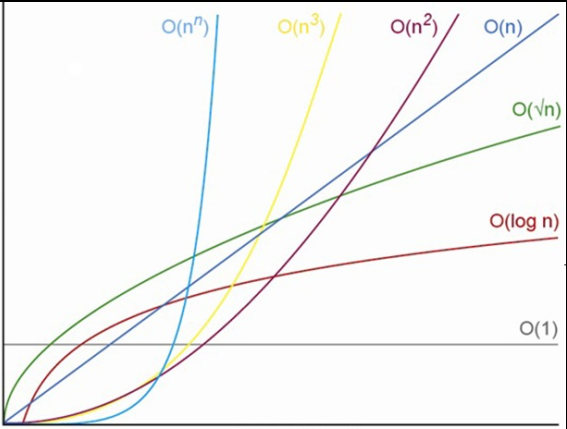

<a name="readme-topo"></a>

<div align='center'>
  
</div>

<h1 align='center'>
  Jogo da Vida
</h1>

<div align='center'>

[![IDE][vscode-badge]][vscode-url]
[![Make][make-badge]][make-url]
[![Linguagem][cpp-badge]][cpp-url]

Algoritmos e Estruturas de Dados I

</div>

<details>
  <summary>
  <b style='font-size: 15px'>
    Sumário
  </b>
  </summary>
  <ol>
    <li><a href="#Introdução">Introdução</a></li>
    <li><a href="#Fundamentação-Teórica">Fundamentação Teórica</a></li>
    <li><a href="#Objetivos">Objetivos</a></li>
    <li><a href="#Metodologia">Metodologia</a></li>
    <li>
      <a href="#Começando">Começando</a>
      <ul>
        <li><a href="#Pré-requisitos">Pré-requisitos</a></li>
        <li><a href="#Instalação-e-Execução">Instalação e Execução</a></li>
      </ul>
    </li>
    <li><a href="#Conclusão">Conclusão</a></li>
    <li><a href="#Ambiente-de-Compilação">Ambiente de Compilação</a></li>
    <li><a href="#Referências">Referências</a></li>
    <li><a href="#Contato">Contato</a></li>
  </ol>
</details>


## Introdução

<div align="justify">

Este [trabalho][trabalho-url] foi proposto na disciplina de Algoritmos e Estruturas de Dados I (AEDSI) pelo professor [Michel Pires da Silva][github-prof].

Simplificadamente, o trabalho consiste numa implementação computacional do autômato celular chamado de Jogo da Vida (do inglês, [Game of Life][livroJV-url][^2]). O conceito por trás deste jogo foi criado no ano de 1970 pelo matemático John Horton Conway (1937-2020), que foi mundialmente reconhecido por realizar outras contribuições matemáticas ao meio.

A implementação computacional proposta consiste, basicamente, na manipulação de elementos de uma matriz de duas dimensões e de tamanho mínimo 5x5, com seus valores variando entre 1 ou 0 (verdadeiro ou falso/vivo ou morto). Seus elementos devem estar inicialmente dispostos numa proporção de 2 para 1 para os valores de 0 e 1, respectivamente. Isto é, há o dobro de células mortas em relação às vivas na matriz inicial. Com tudo isso preparado, o jogo se inicia seguindo um conjunto de regras simples - que serão apresentadas nas seções subsequentes - e continua pela quantidade de gerações indicadas pelo usuário.

</div>

<p align="right">(<a href="#readme-topo">voltar ao topo</a>)</p>

## Fundamentação Teórica

<p align="right">(<a href="#readme-topo">voltar ao topo</a>)</p>

## Objetivos


<p align="right">(<a href="#readme-topo">voltar ao topo</a>)</p>

## Metodologia

<p align="right">(<a href="#readme-topo">voltar ao topo</a>)</p>

## Conclusão

<p align="right">(<a href="#readme-topo">voltar ao topo</a>)</p>

## Começando

Nesta seção estão exemplificados os meios para que se possa compilar e executar o programa apresentado.

### Pré-requisitos

Inicialmente, algumas considerações importantes sobre como se deve preparar o ambiente para compilar e executar o programa:

> [!NOTE]
> Recomenda-se usar uma distribuição de sistema operacional Linux ou o Windows Subsystem for Linux (WSL), pois os comandos no [`makefile`][makefile] foram selecionados para funcionar em um ambiente [_shell/bash_][bash-url].

  - Considerando um ambiente _shell_, garanta que os seguintes comandos já foram executados:
    - Atualize os pacotes antes da instalação dos compiladores:
    ```console
    sudo apt update
    ```
    - Instale a coleção de compiladores ___GNU/g++___ e o ___make___:
    ```console
    sudo apt install build-essential
    ```
    - Se necessário, instale o ___make___ individualmente:
    ```console
    sudo apt install make
    ```

### Instalando

Com o ambiente preparado, os seguintes passos são para a instalação, compilação e execução do programa localmente:

<!-- Ensinar a clonar a pasta do repositório -->
1. Clone o repositório no diretório desejado e acesse o diretório do projeto:
  ```console
  git clone https://github.com/alvarengazv/trabalhosAEDS1.git
  cd trabalhosAEDS1/JogoDaVida
  ```
2. Compile o programa com o ___make___, o que gera a pasta `build`, que contém arquivos de objeto e um arquivo executável:
  ```console
  make
  ```
3. Execute o programa da pasta `build` após a compilação:
  ```console
  make run
  ```
4. Se necessário, apague a última compilação da pasta `build`:
  ```console
  make clean
  ```

O programa estará pronto para ser testado.

<p align="right">(<a href="#readme-topo">voltar ao topo</a>)</p>

## Ambiente de Compilação

> [!IMPORTANT] 
> O trabalho foi desenvolvido, compilado e executado em um ambiente com as seguintes especificações:

<div align='center'>

![Ubuntu][ubuntu-badge]
![Ryzen][ryzen-badge]
![Lenovo][lenovo-badge]

SO | CPU | RAM
--- | --- | ---
Ubuntu 22.04.4 LTS | Ryzen 5 5500U 2.1GHz | 2x4GB 3200MHz

</div>

<p align="right">(<a href="#readme-topo">voltar ao topo</a>)</p>

## Referências

GARDNER, M. **Mathematical games:** the fantastic combinations of John Conway’s new solitaire game “life”, Scientific American 223:120–123, 1970.

JOHNSTON, N; GREENE, D. **Conway's Game of Life:** Mathematics and Construction. [_S.l.: s.n._], 2022. _E-book_. Disponível em: https://conwaylife.com/book/conway_life_book.pdf. Acesso em: 29 mar. 2024.

<p align="right">(<a href="#readme-topo">voltar ao topo</a>)</p>

## Contato

<div align="center">
   <i>Guilherme Alvarenga de Azevedo - 3º Período de Engenharia de Computação @ CEFET-MG</i>
<br><br>

[![Gmail][gmail-badge]][gmail-autor]
[![Linkedin][linkedin-badge]][linkedin-autor]
[![Github][github-badge]][github-autor]
</div>

<p align="right">(<a href="#readme-topo">voltar ao topo</a>)</p>


[^1]: JOHNSTON, N; GREENE, D. **Conway's Game of Life:** Mathematics and Construction. [_S.l.: s.n._], 2022. _E-book_. Disponível em: https://conwaylife.com/book/conway_life_book.pdf. Acesso em: 29 mar. 2024.

[^2]: GARDNER, M. **Mathematical games:** the fantastic combinations of John Conway’s new solitaire game “life”, Scientific American 223:120–123, 1970.

[vscode-badge]: https://img.shields.io/badge/Visual%20Studio%20Code-0078d7.svg?style=for-the-badge&logo=visual-studio-code&logoColor=white
[vscode-url]: https://code.visualstudio.com/docs/?dv=linux64_deb
[make-badge]: https://img.shields.io/badge/_-MAKEFILE-427819.svg?style=for-the-badge
[make-url]: https://www.gnu.org/software/make/manual/make.html
[cpp-badge]: https://img.shields.io/badge/c++-%2300599C.svg?style=for-the-badge&logo=c%2B%2B&logoColor=white
[cpp-url]: https://en.cppreference.com/w/cpp
[trabalho-url]: https://drive.google.com/file/d/1Y7qkA7pisIWjmh77S078_xkbtndmSPZn/view?usp=sharing
[github-prof]: https://github.com/mpiress
[livroJV-url]: https://conwaylife.com/book/conway_life_book.pdf
[makefile]: ./makefile
[bash-url]: https://www.hostgator.com.br/blog/o-que-e-bash/
[lenovo-badge]: https://img.shields.io/badge/lenovo%20laptop-E2231A?style=for-the-badge&logo=lenovo&logoColor=white
[ubuntu-badge]: https://img.shields.io/badge/Ubuntu-E95420?style=for-the-badge&logo=ubuntu&logoColor=white
[ryzen-badge]: https://img.shields.io/badge/AMD%20Ryzen_5_5500U-ED1C24?style=for-the-badge&logo=amd&logoColor=white
[linkedin-badge]: https://img.shields.io/badge/-LinkedIn-0077B5?style=for-the-badge&logo=Linkedin&logoColor=white
[linkedin-autor]: https://www.linkedin.com/in/guilherme-alvarenga-de-azevedo-959474201/
[github-badge]: https://img.shields.io/badge/github-%23121011.svg?style=for-the-badge&logo=github&logoColor=white
[github-autor]: https://github.com/alvarengazv
[gmail-badge]: https://img.shields.io/badge/-Gmail-D14836?style=for-the-badge&logo=Gmail&logoColor=white
[gmail-autor]: mailto:gui.alvarengas234@gmail.com
