<a name="readme-topo"></a>

<div align='center'>
  
</div>

<h1 align='center'>
  Algoritmos MinMax - Análise Assintótica
</h1>

<div align='center'>

[![IDE][vscode-badge]][vscode-url]
[![Make][make-badge]][make-url]
[![Linguagem][cpp-badge]][cpp-url]

Algoritmos e Estruturas de Dados I

</div>

<details>
  <summary>
  <b style='font-size: 15px'>
    📑 Sumário
  </b>
  </summary>
  <ol>
    <li><a href="#-Introdução">🔍 Introdução</a></li>
    <li>
      <a href="#-Fundamentação-Teórica">💡 Fundamentação Teórica</a>
      <ul>
        <li><a href='#Algoritmos-MinMaxMaxMin'>Algoritmos MinMax/MaxMin </a>
        <ul>
          <li><a href='#1-MinMax-1'>1. MinMax 1</a></li>
          <li><a href='#2-MinMax-2'>2. MinMax 2</a></li>
          <li><a href='#3-MinMax-3'>3. MinMax 3</a></li>
          <li><a href='#4-Técnica-do-uso-de-um-Oráculo'>4. Técnica do uso de um Oráculo</a></li>
          <li><a href='#5-Curiosidade-MinMax-4'>5. Curiosidade MinMax 4</a></li>
        </ul>
        </li>
        <li><a href='#Método-de-Ordenação-QuickSort'>Método de Ordenação (QuickSort)</a></li>
        <li><a href='#Outros-Fatores-Determinantes'>Outros Fatores Determinantes</a></li>
      </ul>
    </li>
    <li>
      <a href="#-Objetivos">🎯 Objetivos</a>
      <ul>
        <li><a href='#Objetivo-Geral'>Objetivo Geral</a></li>
        <li><a href='#Objetivos-Específicos'>Objetivos Específicos</a></li>
      </ul>
    </li>
    <li>
      <a href="#-Metodologia">🔬 Metodologia</a>
      <ul>
        <li><a href='#Arquivos'>Arquivos</a></li>
        <li><a href='#Bibliotecas'>Bibliotecas</a></li>
        <li><a href='#Funções'>Funções</a></li>
        <li><a href='#Detalhes-de-Implementação'>Detalhes de Implementação</a></li>
      </ul>
    </li>
    <li>
      <a href="#-Testes-e-Análises-dos-Resultados">📊 Testes e Análises dos Resultados</a>
      <ul>
        <li><a href="#Arquivo-de-Saída">Arquivo de Saída</a></li>
        <li>
          <a href="#Gráficos-Gerados">Gráficos Gerados</a>
          <ul>
            <li><a href="#1-Execução-Padrão">1. Execução Padrão</a></li>
            <li><a href="#2-Testes-no-desktop">2. Testes no desktop</a></li>
            <li><a href="#3-Gráfico-de-Funções-de-Custo">3. Gráfico de Funções de Custo</a></li>
          </ul>
        </li>
        <li>
          <a href="#Geração-do-Código-no-Compilador">Geração do Código no Compilador</a>
          <ul>
            <li><a href="#1-Padrão">1. Padrão</a></li>
            <li><a href="#2-Testes-com-Flag--O3">2. Testes com Flag -O3</a></li>
          </ul>
        </li>
        <li><a href="#Interpretação-dos-Resultados-e-Primeiras-Conclusões">Interpretação dos Resultados e Primeiras Conclusões</a></li>
      </ul>
    </li>
    <li><a href="#-Conclusão">🏁 Conclusão</a></li>
    <li>
      <a href="#-Começando">🔨 Começando</a>
      <ul>
        <li><a href="#Pré-requisitos">Pré-requisitos</a></li>
        <li><a href="#Instalando">Instalando</a></li>
      </ul>
    </li>
    <li><a href="#-Ambiente-de-Compilação-e-Execução">🧪 Ambiente de Compilação e Execução</a></li>
    <li><a href="#-Referências">📚 Referências</a></li>
    <li><a href="#-Contato">📨 Contato</a></li>
  </ol>
</details>


## 🔍 Introdução

<div align="justify">

Este [trabalho][trabalho-url] (Algoritmos MinMax) foi proposto na disciplina de Algoritmos e Estruturas de Dados I (AEDSI) pelo professor [Michel Pires da Silva][github-prof].

Um dos problemas mais comuns na área da computação é a busca pelo algoritmo "perfeito" para resolver cada tipo de situação proposta. Para tal, deve-se delimitar qual fator de performance, a partir do qual os algoritmos serão avaliados e comparados. O principal método de análise utilizado na área é o da análise assintótica ou, em algumas literaturas, _Big O_ ($\mathcal{O}$). Esse método utiliza o tamanho $n$ da entrada para **estimar** o crescimento do tempo de execução de um algoritmo, através de uma função $f(n)$ que represente o custo e o comportamento do algoritmo em questão. O algoritmo considerado "melhor" (ou dominante) numa comparação assintótica com situações equivalentes, não necessariamente será mais rápido, já que a análise considera apenas o número de interações com cada dado da entrada. Porém, o resultado da comparação nos dá uma boa ideia de qual algoritmo performaria melhor ao gerenciar uma entrada de tamanho $n$, que tende ao infinito. Em outras palavras, "O comportamento assintótico de $f(n)$ representa o limite do comportamento do custo quando $n$ cresce" (ZIVIANI, 2006, p. 31, cap. 1)[^1].

Neste contexto, o professor Nívio Ziviani da UFMG demonstrou, inicialmente, três algoritmos que possuem o mesmo objetivo inicial: encontrar o menor e maior valores de um conjunto de $n$ dados de entrada, cada um com um comportamento diferente. Contudo, apesar de os algoritmos performarem de acordo com sua $f(n)$ de custo (determinada pela distribuição dos dados da entrada), todos mantêm um custo linear e podem ser considerados **ótimos** para o problema proposto, de classe linear.

<div align='center' style='font-size: 11px'>

**Figura 1**: Funções $f(n)$ para 3 casos de cada Algoritmo MaxMin proposto

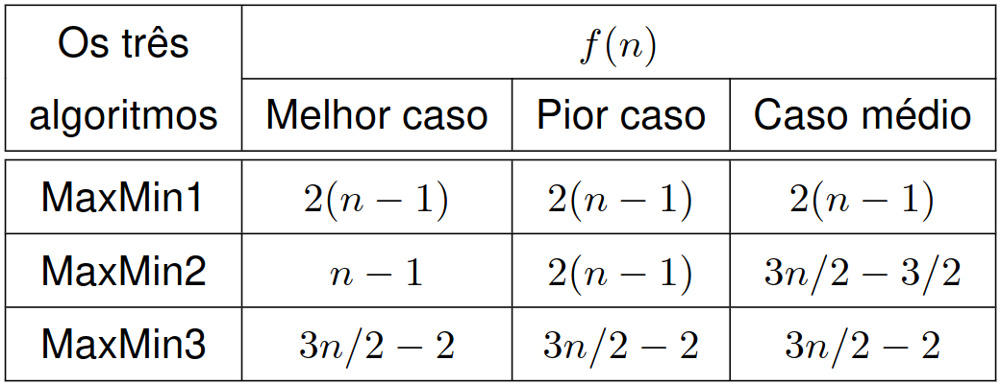

**Fonte**: Projeto de Algoritmos com Implementações em Java e C++. [^1]

</div>

Como a Figura 1 mostra, todos os algoritmos possuem funções de custo da classe linear, ou seja, são dominadas assintoticamente por $n$: $f(n) = \mathcal{O}(n)$. Entretanto, visualmente é possível notar que há uma diferença, mesmo que de constantes, entre elas. No final das contas, pode ser que todos performem de maneira similar para um $n$ muito alto, considerando a mesma ordenação da entrada, que não faça muita diferença na prática. Mas, para afirmar com maior veracidade, é necessário realizar testes de performance de cada algoritmo quando executados sob as mesmas condições iniciais, sejam elas de _hardware_, _software_ ou relacionados à entrada. Assim, os resultados podem nos levar a conclusões não tão triviais de se pensar inicialmente.

Os testes propostos pelo enunciado do trabalho consideram que cada algoritmo deverá ser executado 10 vezes para cada conjunto `tamanho-ordem` da entrada $n$ e ter sua média de tempo de execução calculada. Especificamente, cada algoritmo será executado com vetores de 4 tamanhos distintos (1000, 10000, 100000, 500000) e em 3 ordens para cada tamanho (Aleatória, Crescente e Decrescente). Ao final, cada algoritmo terá sido executado $10 \times 3 \times 4 = 120$ vezes, além de terem suas 12 médias guardadas em um arquivo de resultados em formato de planilha. Com os dados, deve-se gerar gráficos para a representação visual destes resultados e realizar uma interpretação + análise comparativa entre eles. 

</div>

<p align="right">(<a href="#readme-topo">voltar ao topo</a>)</p>

## 💡 Fundamentação Teórica

<div align='justify'>

### Algoritmos MinMax/MaxMin

##### 1. MinMax 1
```cpp
void minMax1(int *&vetor, int n, int &min, int &max){
    max = vetor[0];
    min = vetor[0];

    for(int i = 1; i < n; i++){
        if(vetor[i] > max)               // ----> Custo (n -1)
            max = vetor[i];
        if(vetor[i] < min)               // ----> Custo (n -1)
            min = vetor[i];   
    }
}
// ----> Custo total para todos os casos: 2(n- 1)
```

Para este algoritmo, a função de custo $f(n)$ é igual a $2(n-1)$ para todos os casos de entrada. Isso ocorre pois em toda execução do método, dentro do `for-loop`, as comparações/desvios serão sempre realizados para cada dado da entrada. Ou seja: 

<div align='center'>

$f(n) = (n-1) + (n-1) = 2(n-1)$*.

</div>

*O fator $(n-1)$ possui o $(-1)$ pois o `for-loop` se inicia no segundo elemento do `vetor`, já que o primeiro já foi atribuído às variáveis `min` e `max`.

##### 2. MinMax 2
```cpp
void minMax2(int *&vetor, int n, int &min, int &max){
    max = vetor[0];
    min = vetor[0];
    
    for(int i = 1; i < n; i++){
        if(vetor[i] > max)
            max = vetor[i];
        else if(vetor[i] < min)
            min = vetor[i];
    }
}
```
Neste caso, as funções de custo dependem da ordenção dos dados de entrada.

##### 2.2 Melhor Caso

O melhor caso para este método seria o caso em que o primeiro `if` seria verdadeiro todas as vezes. Ou seja, se o vetor de entrada estiver ordenado crescentemente, sempre será necessário trocar o valor de `max`, e o valor de `min` será o correto desde o início. Isso faz com que a função de custo deste algoritmo, neste caso, seja: 

<div align='center'>

$f(n) = n-1$*

</div>

##### 2.3 Pior Caso

O pior caso para este algoritmo seria o inverso do anterior, em que, além de verificar o primeiro `if`, sempre passsará para o `else-if`. Para tal, o `vetor` deveria estar ordenado em ordem decrescente e, assim, cada valor subsequente não seria maior que o anterior. Isto é, a função de custo dele, dependendo da quantidade de elementos vale, neste caso: 

<div align='center'>

$f(n) = (n-1) + (n-1) = 2(n-1)$*

</div>

##### 2.1 Caso Médio

No caso médio para o Minmax 2, o algoritmo executaria na metade dos elementos o `else-if` e no em todos, o primeiro `if`. Ou seja, o custo da primeira comparação/desvio seria $n-1$ e no `else-if` seria $\frac{n-1}{2}$. Dessa forma, a função de custo total neste caso seria: 

<div align='center'>

$f(n) = (n-1) + \frac{n-1}{2} = \frac{3n-3}{2} = \frac{3n}{2} - \frac{3}{2}$

</div>
<br><br>

*O fator $(n-1)$ possui o "$-1$" pois o `for-loop` se inicia no segundo elemento do `vetor`, já que o primeiro já foi atribuído às variáveis `min` e `max`.

##### 3. MinMax 3
```cpp
void minMax3(int *&vetor, int n, int &min, int &max){
    int fimDoAnel = 0; 

    if(n % 2 > 0){
        vetor[n] = vetor[n-1];
        fimDoAnel = n;
    } else 
        fimDoAnel = n-1;

    if(vetor[0] > vetor[1]){
        max = vetor[0];
        min = vetor[1];
    } else {
        max = vetor[1];
        min = vetor[0];
    }

    int i = 2;
    while(i < fimDoAnel){
        if(vetor[i] > vetor[i+1]){             // ----> Custo [(n/2)] 
                                               // Se verdadeiro
            if(vetor[i] > max)                 // ----> Custo [(n/2) - 1] 
                max = vetor[i];
            if(vetor[i+1] < min)               // ----> Custo [(n/2) - 1]
                min = vetor[i+1];
        } else {
                                               // Se falso
            if(vetor[i+1] > max)               // ----> Custo [(n/2) - 1]
                max = vetor[i+1];
            if(vetor[i] < min)                 // ----> Custo [(n/2) - 1]
                min = vetor[i];
        }
        i += 2;
    }
}
// ----> Custo total para todos os casos: (3n/2) - 2
```

Para este algoritmo, assim como o MinMax 1, a função de custo $f(n)$ é a mesma em todos os casos e pode é calculada com:
 - O custo do primeiro `if` é igual a $\frac{n}{2}$, já que os dados estão sendo acessados 2 a 2, ou seja, haverá um número de comparações igual à metade do tamanho da entrada. 
 - Já o custo da "parte de dentro" do `if` **ou** do `else` será igual a $\frac{n}{2} - 1 = \frac{n-2}{2}$ para cada comparação/desvio realizados. Isso ocorre pois cada um dos `if's` são executados com a massa de dados ($\frac{n}{2}$) exceto um dos valores visualizados (`vetor[i]` ou `vetor[i+1]`). Dessa forma, chega-se à função de custo geral:

<div align='center'>

$f(n) = \frac{n}{2} + \frac{n-2}{2} + \frac{n-2}{2} = \frac{3n-4}{2} = \frac{3n}{2} - 2$

</div>

Ao final dessa conclusão, define-se que os três Algoritmos (Minmax1, Minmax2 e Minmax3) se enquadram na classe de algoritmos lineares e podem ter suas funções definidas como $f(n) = \mathcal{O}(n)$, ou seja, $n$ domina todas as $f(n)$ assintoticamente. Diz-se que $f(n)$ é da ordem no máximo $n$.

##### 4. Técnica do uso de um Oráculo

Essa técnica foi utilizada por Ziviani (2006, p. 27, cap. 1)[^1] no exemplo Maxmin para confirmar se as funções de custo encontradas podem ser consideradas ótimas. A técnica consiste na busca de um **limite inferior** para esse tipo de algoritmo. Para tal, cria-se um modelo de comportamento do algoritmo através do qual serão considerados os resultados de cada um dos passos (no caso comparações) do método. Ao final, espera-se chegar a um resultado que permita a classificação do algoritmo em questão.

O oráculo se inicia com a definição do modelo adaptado para o comportamento, que, no caso, segue a seguinte [4-tupla][tupla-url]:

<div align='center'>

$(a, b, c, d)$

Em que: 
$a$ são elementos da entrada que não sofreram interações;
$b$ são elementos da entrada venceram uma comparação, ou seja, valor Max;
$c$ são elementos da entrada perderam uma comparação, ou seja, valor Min;
$d$ são elementos da entrada que venceram e/ou perderam comparações, mas que foram substituídos;

</div>

Essa 4-tupla começará com valores: $(n, 0, 0, 0)$ e terminará com valores $(0, 1, 1, n-2)$. Para isso, as variáveis $a, b, c$ e $d$ poderão sofrer alguns tipos de alterações. Para atingir o objetivo final da forma mais rápida possível, neste caso, deverão ser realizadas as seguintes alterações: 

<div align='center'>

$(0, \frac{n}{2}, \frac{n}{2}, 0)$

Levando $a$ a (0), com a entrada sendo comparada de 2 em 2, realizando um total de $(\frac{n}{2})$ comparações;

$(0, 1, \frac{n}{2}, \frac{n}{2} - 1)$

Levando $b$ a (1) e $d$ a $(\frac{n}{2} - 1)$, realizando um total de $(\frac{n}{2} - 1)$ comparações;

$(0, 1, 1, \frac{n}{2} - 1 + \frac{n}{2} - 1)$

Levando $c$ a (1) e $d$ a $(\frac{n}{2} - 1 + \frac{n}{2} - 1)$, realizando um total de $(\frac{n}{2} - 1)$ comparações;

$(0, 1, 1, n - 2)$

</div>

Realizando a técnica, chega-se exatamente ao resultado esperado. Como foi mostrado, o mínimo de operações necessárias para que um Algoritmo MinMax chegue ao resultado final, é de: $(\frac{n}{2}) + (\frac{n}{2} - 1) + (\frac{n}{2} - 1) = \frac{3n}{2} - 2$ comparações. Dessa forma, podemos concluir que "se o número de comparações entre os elementos de um vetor for utilizado como medida de custo, então o algoritmo MaxMin3 é ótimo" (ZIVIANI, 2006, p. 30, cap. 1)[^1].

##### 5. Curiosidade MinMax 4

O problema Minmax pode ser resolvido com outro algoritmo, utilizado como exemplo por Ziviani (2006, p. 23, cap. 2)[^1]. Este método, por sua vez, utiliza do conceito de `Divisão e Conquista`, muito bem abordado e explicado por Cormen (2012, p. 48-78)[^2].

<div align='center' style='font-size: 11px'>

**Figura 2**: Minmax 4 - Divisão e Conquista

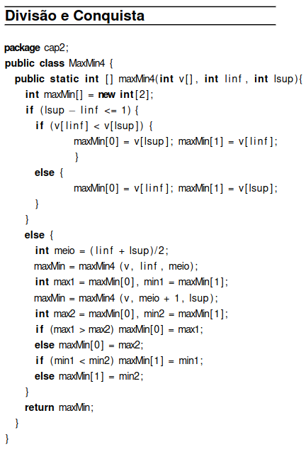

**Fonte**: Projeto de Algoritmos com Implementações em Java e C++

</div>

Como pode ser observado, o algoritmo acima se utiliza de recursividade para resolver o problema. Apesar de também ser de ordem linear, como provado pelo uso do Teorema Mestre por Ziviani[^1], a sua função de custo $T(n)$ não supera o limite inferior encontrado pelo uso do oráculo $(\frac{3n}{2} - 2)$.

### Método de Ordenação (QuickSort)

Para que os vetores pudessem ser ordenados conforme necessário e com tamanhos muito grandes, não seria vantajoso fazer o uso de algoritmos tais como o `Bubble Sort` ou `Selection Sort`, já que ambos possuem custo quadrático, sendo $O(n^{2})$ e, para tamanhos de $n$ muito grandes, o tempo necessário atrasaria o curso do programa. Com isso, foi necessário utilzar algoritmos de menor função de custo, como o `Quick Sort`, que foi escolhido por ser, na maior parte das vezes, $O(n\times \log{n})$[^7]. 

A base deste método é utilizar a estratégia de `Divisão e Conquista`. Simplificadamente, ao se dividir o vetor por dois, a cada chamada da função, o algoritmo posiciona o elemento `pivô` na sua posição correta e, ao fim, tem-se o vetor ordenado crescente ou decrescentemente. Para explicações mais aprofundadas, recomenda-se a leitura do capítulo 7 do livro Algoritmos[^2] e um repositório gratuito de um aluno da UFCG[^7].

### Outros Fatores Determinantes

A análise do custo computacional total e do tempo de execução exato de um determinado programa é algo quase impossível de ser determinado com precisão pelo seguinte fator: depende de **muitas** variáveis. Por conta disso, busca-se padronizar os ambientes de teste utilizados, o que ajuda a minimizar as possíveis diferenças de resultados, referentes à `velocidade do processador`, `quantidade de memória disponível`, `velocidade da memória principal` e `velocidade do disco de armazenamento`. Ainda assim, características de um código/algoritmo considerado ótimo podem ser fatores determinantes após a compilação do mesmo. Isto é, cada tipo de comando, e sua instrução gerada para o processador tem influência direta na performance do algoritmo.

Para exemplificar e afunilar este problema para o caso em questão, podemos considerar o conceito de _pipeline_ implementado nos processadores modernos. Essa implementação funciona muito bem um códigos lineares, isto é, aqueles que fazem buscas consecutivas pelas palavras da memória. Essa última afirmação já explica o maior dos problemas para essa técnica de _pipeline_: desvios de código (condicionais ou não), que fazem com que o processador gaste mais ciclos que o normal para executar a instrução (TANENBAUM, 2012, p. 246-247)[^8], por mais que atualmente existam técnicas a nível de _hardware_ para minimizar esse custo (através de preditor de desvios, do inglês _Brach Predictor_)[^9].

Analogamente, um compilador que seja capaz de gerar códigos em `Assembly` de forma a minimizar a quantidade de desvios e os custos deles, pode garantir um melhor desempenho do algoritmo testado. Além disso, em um mesmo compilador, como o `gcc`, pode-se passar _flags_ de otimização, para que o código gerado seja mais curto, mais leve e implemente instruções de forma a deixar menos custosa a execução do programa.

Aqui, foi estudada e testada a opção `-O3` do `gcc` na versão indicada em [🧪 Ambiente de Compilação e Execução](#-Ambiente-de-Compilação-e-Execução). Essa opção de execução habilita muitas _flags_ de otimização, o que pode acarretar em problemas de portabilidade de código, graças ao conjunto de instruções do processador em que será testada. Porém, de modo geral, a _flag_ `-O3` ajuda a otimizar o código de maneira extrema, "-O3 também realiza otimizações maiores e mais agressivas, que têm o potencial de alterar ligeiramente a semântica do seu programa" (traduzido de [^10]).

</div>

<p align="right">(<a href="#readme-topo">voltar ao topo</a>)</p>

## 🎯 Objetivos

<div align="justify">

  ### Objetivo Geral

  O objetivo deste trabalho envolve a realização de uma profunda avaliação assintótica e comparativa sobre o comportamento de três tipos de algoritmos capazes de encontrar o mínimo e máximo valores de um conjunto finito de números inteiros. 

  ### Objetivos Específicos

  - Analisar as influências que o tamanho da entrada e a ordem do conjunto de dados podem realizar sobre determinados algoritmos.

  - Pesquisar e entender mais sobre a análise de algoritmos que considera apenas o tamanho da entrada para estimar o tempo de execução de um algoritmo, e como isso pode influenciar nos resultados encontrados. 

  - Descobrir e compreender outros tipos de análises que levam em consideração outros fatores impactantes na execução de um programa, sejam eles físicos (em nível de _hardware_) ou relacionados à implementação do algoritmo e do controle que o compilador realiza (em nível de software).

</div>

<p align="right">(<a href="#readme-topo">voltar ao topo</a>)</p>

## 🔬 Metodologia

### Arquivos

<div align="justify">

Para a solução proposta os seguintes diretórios/arquivos foram utilizados: 

  - [`output/csv/medias.csv`][medias-ref]: arquivo em que se encontra os resultados de saída do programa em CSV obtidos em testes no _notebook_;
  - [`output/csv/mediasComFlag.csv`][mediasFlag-ref]: arquivo em que se encontra os resultados de saída do programa em CSV obtidos em testes no _notebook_ com a _flag_ `-O3`;
  - [`output/csv/mediasPC.csv`][mediasPC-ref]: arquivo em que se encontra os resultados de saída do programa em CSV obtidos em testes no _desktop_;
  - [`output/img/graficoComparacaoAlgoritmosPorOrdem.png`][graficoAO-ref]: arquivo em que se encontra os gráficos de comparação entre os algoritmos por ordem, plotados com gnuplot no _notebook_;
  - [`output/img/graficoComparacaoOrdensPorAlgoritmo.png`][graficoOA-ref]: arquivo em que se encontra os gráficos de comparação entre as execuções por ordens diferentes do mesmo algoritmo, plotados com gnuplot no _notebook_;
  - [`output/img/graficoComparacaoAlgoritmosPorOrdemComFlag.png`][graficoAOFlag-ref]: arquivo em que se encontra os gráficos de comparação entre os algoritmos por ordem, plotados com gnuplot no _notebook_, com tempos calculados com a _flag_ `-O3`;
  - [`output/img/graficoComparacaoOrdensPorAlgoritmoComFlag.png`][graficoOAFlag-ref]: arquivo em que se encontra os gráficos de comparação entre as execuções por ordens diferentes do mesmo algoritmo, plotados com gnuplot no _notebook_, com tempos calculados com a _flag_ `-O3`;
  - [`output/img/graficoComparacaoAlgoritmosPorOrdemPC.png`][graficoAOPC-ref]: arquivo em que se encontra os gráficos de comparação entre os algoritmos por ordem, plotados com gnuplot no _desktop_;
  - [`output/img/graficoComparacaoOrdensPorAlgoritmoPC.png`][graficoOAPC-ref]: arquivo em que se encontra os gráficos de comparação entre as execuções por ordens diferentes do mesmo algoritmo, plotados com gnuplot no _desktop_;
  - [`src/main.cpp`][main-ref]: arquivo em que se encontra a função `main()` que executa comandos cruciais do programa;
  - [`src/minMax.cpp`][cppAMM-ref]: arquivo em que se encontra as implementações das funções utilizadas;
  - [`src/mediasMinMax.p`][gnuAMM-ref]: arquivo de extensão P[^4] em que se encontra o script do gnuplot utilizado para a geração dos gráficos em PNG;
  - [`src/minMax.hpp`][hppAMM-ref]: arquivo em que se encontra as assinaturas das funções utilizadas e importações de bibliotecas padrão;
  - [`makefile`][makefile]: arquivo com os comandos para a compilação e execução do programa.

### Bibliotecas

A seguir estão as bibliotecas incluídas no programa e que são essenciais para o funcionamento dele.

  - `"minMax.hpp"`: biblioteca criada pelo autor com funções essenciais para o programa;
  - `<iostream>`[^3]: biblioteca utilizada para as operações de entrada e saída;
  - `<fstream>`[^3]: biblioteca utilizada para manipular a escrita nos arquivos [`output/csv/medias.csv`][medias-ref] e [`output/csv/mediasPC.csv`][mediasPC-ref];
  - `<random>`[^3]: biblioteca utilizada para gerar os números aleatórios para preencher os vetores de entrada para os algoritmos;
  - `<chrono>`[^3]: biblioteca utilizada para calcular, em ms, o tempo de execução de cada algoritmo MinMax;
  - `<string>`[^3]: biblioteca utilizada para utilizar o tipo de variável _string_, para facilitar a geração de resultados nos arquivos de saída.

### Funções

Abaixo estão as funções essenciais para o funcionamento do programa. Com a finalidade de simplificar a escrita, os parâmetros de cada uma delas foram ocultados.

  - `int main()`: função principal do programa que cria variáveis e faz chamadas de funções importantes para o programa;
  
  - `void controladorMinMax()`: esta função atua como um controlador para calcular o tempo médio gasto para os três algoritmos minmax. Isso é feito para situações de tamanho e ordenação do vetor diferentes. Aqui, o arquivo CSV é gerado e as funções para a correta execução dos testes para os três algoritmos são chamadas;

  - `void mudarOrdem()`: esta função é responsável por alterar a ordem dos elementos do vetor com tamanho n. O parâmetro `ordem` especifica o tipo de alteração desejada (por exemplo, crescente = 1 ou decrescente = 2). Essa função utiliza o algoritmo `quickSort` para modificar o vetor de acordo com a ordem especificada;

  - `void encontraMediaMinMaxGeral()`: esta função calcula o tempo médio de execução de cada algoritmo minmax e encontra os resultados a partir de um vetor de `tamanho` e `ordem` passados como parâmetro e armazena-os no `arquivo` CSV;

  - `void minMax1()`: esta função é responsável por encontrar os valores mínimo (min) e máximo (max) em um vetor vetor de inteiros com tamanho n, seguindo as especificidades do Algoritmo MaxMin1 (ZIVIANI, 2006, p. 20, cap. 1)[^1];

  - `void minMax2()`: esta função é responsável por encontrar os valores mínimo (min) e máximo (max) em um vetor vetor de inteiros com tamanho n, seguindo as especificidades do Algoritmo MaxMin2 (ZIVIANI, 2006, p. 22, cap. 1)[^1];

  - `void minMax3()`: esta função é responsável por encontrar os valores mínimo (min) e máximo (max) em um vetor vetor de inteiros com tamanho n, seguindo as especificidades do Algoritmo MaxMin3 (ZIVIANI, 2006, p. 24, cap. 1)[^1];

  - `void preencheVetor()`: esta função muda o tamanho do vetor utilizado para $n$ e o preenche com valores aleatórios entre 0 e 1000 gerados pela função `rand()` da biblioteca `<random>`;

  - `void geraGraficos()`: esta função executa um comando através da função `popen()`, que permite a execução de comandos em terminal através do código em C++. O comando seleciona um arquivo contendo um script para geração de gráficos utilizando o software ___gnuplot___. O conteúdo desse arquivo inclui instruções para plotar dados, ajustar estilos, configurar rótulos e legendas, entre outras configurações gráficas;

  - `int particionaCrescente()`: esta função é parte de um algoritmo de ordenação (o `quickSort`, no caso) e particiona um vetor de inteiros em ordem crescente;

  - `void quickSortOrdenacaoCrescente()`: esta função implementa o algoritmo `quickSort` para ordenar um vetor de inteiros em ordem crescente de maneira recursiva;

  - `int particionaDecrescente()`: esta função é parte de um algoritmo de ordenação (o `quickSort`, no caso) e particiona um vetor de inteiros em ordem decrescente;

  - `void quickSortOrdenacaoDecrescente()`: esta função implementa o algoritmo `quickSort` para ordenar um vetor de inteiros em ordem decrescente de maneira recursiva.

### Detalhes de Implementação

  #### 1. Mudança da _seed_ do Gerador de Números

  - A primeira linha da função `main()` faz-se uma chamada da função `srand()` passando como parâmetro outro método `time(NULL)` que retorna o tempo em segundos desde meia noite do dia 01/01/1970 UTC*.

  - Essa chamada de função existe para que, a cada execução do programa, o método `rand()` gere números pseudo-aleatórios diferentes. Isso funciona pois o tempo está sempre avançando e, a cada segundo, essa `seed` (ou semente) se altera.

  *Essa data de 1º de Janeiro de 1970 às 00:00:00 UTC foi arbitrariamente escolhida pelos engenheiros da [Unix](https://en.wikipedia.org/wiki/Unix) na mesma década, e ficou conhecido como _Epoch Time_[^5]. Essa "medida de tempo" se tornou uma das mais utilizadas em sistemas de computador desde então, mas existem diversos outros modelos, como o `Cocoa (NSDate)`, que é utilizado em dispositivos _iOS/OS X_ e é contado a partir de 1º de Janeiro de 2001 GMT.

  #### 2. Chamada do Método Controlador

  - A função controladora do programa dos Algoritmos Minmax é chamada e recebe uma variável do tipo _string_ criada para armazenar o nome do `diretório + nome do arquivo de saída` na `main()` para facilitar a alteração caso necessário.

  ##### 2.1 Preparação do Algoritmo

  - No início da função `controladorMinMax()` há a criação de variáveis importantes para o funcionamento do programa:
    - `int tamanhos[4]`: vetor de inteiros com 4 posições, que armazena os tamanhos possíveis de entrada para os algoritmos, decididos pelo enunciado do problema (1000, 10000, 100000, 500000);
    - `int *vetor`: vetor principal do programa, que terá o tamanho, ordem e elementos alterados durante a execução do programa. Este vetor será vasculhado a cada execução de um Algoritmo Minmax para encontrar seus valores máximo e mínimo;
    - `int min, max`: as duas variáveis que armazenarão os resultados de cada execução dos Algoritmos Minmax, isto é, o `min` receberá o menor valor do vetor e o `max`, o maior. Essas variáveis são sempre passadas por referência para funções e têm seus valores posicionados no arquivo de saída para cada execução, a fim de se validar o funcionamento dos algoritmos;
    - `int t = 1`: essa variável é usada apenas para dar título a cada tempo de execução no arquivo CSV de saída. Isso é feito num _loop_ `while`, em que o valor de `t` varia de 1 a 10 e é colocado no arquivo;
    - `std::ofstream arquivo`: variável que representará o arquivo de saída, por isso, `ofstream` (**O**utput**F**ile**Stream**)[^3];
    - `std::string *stringsMinmax`: vetor de 3 posições para armazenar as `strings` de cada Algoritmo MinMax.

  - Ao se validar a abertura/criação do arquivo, inicia-se a construção do arquivo de saída CSV. Inicialmente é feito o _header_ com os títulos para as colunas, separados por vírgula, incluindo os títulos de tempos de execução, citados acima, e o das médias.

  ##### 2.2 _Loops_ Externos de Controle de Tamanho e Ordem

  - A partir disso, a parte fundamental do algoritmo de testes começa. Há um _loop_ `for`, em que `i` varia de 0 a 4 e controla o tamanho do vetor. Para tal, em seu início há a chamada do método `preencheVetor()`, que, além de mudar o tamanho do `vetor` de acordo com o índice do vetor `tamanhos[i]`, também o preenche com valores aleatórios de 0 a 1000 (valores definidos no enunciado do exercício).

  - Adiante, há outro _loop_ `for`, em que `j` varia de 0 a 3, que permite o controle das ordenações do vetor em cada uma das 3 execuções, sendo 0 aleatório, 1 crescente e 2 decrescente. No início há a mudança da ordem do vetor através da chamada da função `mudarOrdem()`. Esta, por sua vez, possui um condicional `switch-case`, em que, para 0, não faz nada, para 1, chama o método `quickSortOrdenacaoCrescente()` e, para 2, chama o método `quickSortOrdenacaoDecrescente()`.

  - Após a ordenação, há a chamada da função `encontraMediaMinMaxGeral()` que realiza cada uma das 10 execuções de cada Algoritmo Minmax e calcula a média para cada execução `tamanho-ordem-minmax`;

  ##### 2.3 Execução Principal do Problema

  - Aqui, há a criação de variáveis como a `double soma`, que armazena a soma dos tempos de execução para realizar a média, a `std::string ordemString`, que armazena a ordem atual do vetor em forma de texto (0 - "Aleatória", 1 - "Crescente", 2 - "Decrescente"). E, após isso, a variável `int alg` que controla qual Algoritmo Minmax será executado*.

  - Mais um _loop_, agora `while`, que se inicia com a edição da _string_ do vetor `stringsMinmax[alg]`, na posição referente ao algoritmo em questão. Essa modificação adiciona a primeira parte das linhas de saída, que conta com o tipo do Minmax, a ordem atual e o tamanho do vetor.

  - Agora o último _loop_ `for` da execução padrão do programa (excluindo os que estão nos Algoritmos Minmax e serão discutidos na seção [📊 Testes e Análises dos Resultados](#-Testes-e-Análises-dos-Resultados)). Esse laço de repetição varia `i` de 0 a `QTDEXECUCOES` (constante, por padrão = 10). Nesta parte do código são feitos:

    - A marcação de tempo do início e fim do Algoritmo Minmax executado, através da função `std::chrono::high_resolution_clock::now()` e a subtração `final - inicio`;
    - Um `switch-case` para escolher o método `minMax1()`, `minMax2()` ou `minMax3()`;
    - A adição, na _string_ `stringsMinmax[alg]`, de cada um dos 10 tempos de execução do mesmo algoritmo e a soma desse valor com a variável `soma`.
  
  - Ao se acabar o laço `for` são adicionados à `stringsMinmax[alg]`, a média dos 10 tempos de execução, além dos valores encontrados para `min` e `max` na última execução.

  - A variável `soma` é zerada e `alg` recebe um incremento.

  *0 representa o Algoritmo de função `minMax1()`, 1 o Algoritmo de função `minMax2()` e 2 o Algoritmo de função `minMax3()`.

  ##### 2.4 Finalização do Controlador

  - Ao fim, no método `controladorMinMax()`, as _strings_ do vetor `stringsMinmax[]` são adicionadas em ordem (0, 1 e 2) no final do arquivo de saída, o arquivo é fechado e a memória do `vetor` é liberada com o comando `delete vetor`.

  #### 3. Chamada do Método Gerador de Gráficos

  - Retornando à função `main()`, há a chamada do método `geraGraficos()`;
  
  - Nesta função foi utilizado o conceito de _pipe_[^6], em que, inicialmente é formada uma _string_ de comando para executar o script do __gnuplot__ do arquivo [`src/mediasMinMax.p`][gnuAMM-ref]. Tal _string_ é passada para o método `popen()` com a configuração padrão "r", que retorna um arquivo de saída temporário à variável `pipe`. Por fim essa variável é "fechada" com o método `pclose()`;

  - Finalmente, a função `main()` retorna 0.

  #### 4. Script _gnuplot_
  
  ##### 4.1 Os Gráficos Plotados
  O arquivo [`src/mediasMinMax.p`][gnuAMM-ref] possui um algoritmo para a geração de gráficos com os dados gerados no arquivo [`output/csv/medias.csv`][medias-ref]. Nele, é considerada a estrutura em linhas dos resultados da saída e são gerados gráficos formatados "a gosto do autor". Mas, eles foram formados para possibilitar a realização da comparação entre os tempos de execução de um mesmo algoritmo conforme se alteram a ordem e o tamanho do vetor de entrada. Além disso, também foram gerados gráficos de comparação do tempo de execução entre os algoritmos pela ordem e tamanho do vetor de entrada. E, por fim, há um gráfico hipotético das funções $f(n)$ de todos os algoritmos em seus casos médios, melhores e piores casos.

  ##### 4.2 O Script de Geração 

  Uma breve explicação do _script_:

  - Muda o separador dos dados para "," e padroniza o arquivo de saída como PNG de tamanho 1920x1080, fonte Arial e tamanho 10;

  - Cria uma variável da data e hora do momento da execução, para mostrar no título;

  - É indicado qual será o diretório e arquivo de saída;

  - Cria um layout para suportar vários gráficos na mesma imagem com um título especificado;

  - Indica as cores e tipos de cada linha de gráficos de funções plotadas no mesmo plano cartesiano;

  - Define o intervalo dos eixos x e y e qual será o "passo" em cada um deles;

  - Configura os gráficos para terem um _grid_ (malha que liga os pontos de x e y);

  - Define os nomes dados ao eixo x e y;

  - Escolha do título do primeiro gráfico e o comando para plotar cada linha, que segue o mesmo padrão* para os próximos três gráficos;

  - Definição das funções de cada algoritmo de acordo com seus casos médios, melhores e piores casos, para plotagem no quarto gráfico;

  - Muda-se os títulos e o arquivo PNG de saída e se repete os mesmos comando alterando apenas quais linhas serão consideradas em cada;

  ```console
  * plot 'output/csv/medias.csv' skip 1 every 3::::9 u 3:14 t "Ordem Aleatória" with lp
  ```
  *Aqui, inicialmente se indica o arquivo CSV de entrada. O comando `skip 1` pula a primeira linha do arquivo CSV. Já o comando `every 3::::9` salta 3 linhas a partir da inicial do comando e faz isso 3 vezes (9/3) até o final do bloco de dados (9). O comando `u 3:14`, por sua vez, indica quais colunas devem ser consideradas, no caso 3 (tamanho do vetor de entrada) e 14 (média dos testes daquela linha). Por fim, `t "Ordem Aleatória"` indica o título e `with lp` define o tipo de linha do gráfico (lp -> linepoints).

</div>

<p align="right">(<a href="#readme-topo">voltar ao topo</a>)</p>

## 📊 Testes e Análises dos Resultados

<div  align="justify">

A execução da solução aqui proposta é capaz de fazer todo o processo de geração determinado pelo trabalho proposto. Desde a criação, ordenação e alteração do vetor, cálculo de cada média e saída diretamente para um arquivo de resultados, até a geração dos gráficos via chamada de um _pipe_ para a execução de um _script_ do **gnuplot**.

### Arquivo de Saída

  O arquivo de saída possui a extensão CSV e está organizado com o intuito de formar uma tabela com os resultados de cada média das execuções dos 3 algoritmos. As informações importantes da tabela são: `Algoritmo`, `Ordenação` do vetor, `Tamanho` do vetor, os 10 `tempos de execução`, a `média dos tempos de execução` em cada caso e os valores `min` e `max` encontrados. Esses dados estão separados por vígulas e dispostos da seguinte maneira:

<div align='center'>

**Tabela 1**: Organização dos dados
| Algoritmo | Ordenação do Vetor | Tamanho do vetor (n) | t1 (ms) | t2 (ms) | t3 (ms) | t4 (ms) | t5 (ms) | t6 (ms) | t7 (ms) | t8 (ms) | t9 (ms) | t10 (ms) | Média (ms) | Min | Max |
| :----- | :----- | :----- | :----- | :----- | :----- | :----- | :----- | :----- | :----- | :----- | :----- | :----- | :----- | :----- | :----- |
| MinMax1 | Aleatória | 1000 | t1 | t2 | t3 | t4 | t5 | t6 | t7 | t8 | t9 | t10 | Média | Min | Max |
| MinMax1 | Crescente | 1000 | t1 | t2 | t3 | t4 | t5 | t6 | t7 | t8 | t9 | t10 | Média | Min | Max |
| MinMax1 | Decrescente | 1000 | t1 | t2 | t3 | t4 | t5 | t6 | t7 | t8 | t9 | t10 | Média | Min | Max |
|  |  |  |  |  |  |  |  |  |  |  |  |  |  |  |  |

.
.
.

|  |  |  |  |  |  |  |  |  |  |  |  |  |  |  |  |
| :----- | :----- | :----- | :----- | :----- | :----- | :----- | :----- | :----- | :----- | :----- | :----- | :----- | :----- | :----- | :----- |
| MinMax3 | Aleatória | 500000 | t1 | t2 | t3 | t4 | t5 | t6 | t7 | t8 | t9 | t10 | Média | Min | Max |
| MinMax3 | Crescente | 500000 | t1 | t2 | t3 | t4 | t5 | t6 | t7 | t8 | t9 | t10 | Média | Min | Max |
| MinMax3 | Decrescente | 500000 | t1 | t2 | t3 | t4 | t5 | t6 | t7 | t8 | t9 | t10 | Média | Min | Max |

**Fonte**: Autor.

</div>

Como pode ser visto, os dados são gerados em ordem. Primeiro, todas as execuções do algoritmo Minmax1, para todas as ordens e para todos os tamanhos de vetores são printadas. Depois as execuções dos algoritmos Minmax2 e Minmax3 seguindo a mesma ordem.

### Gráficos Gerados

##### 1. Execução Padrão

Com o arquivo gerado e dados organizados, foi possível gerar duas plotagens de gráficos do **gnuplot**. A primeira, conta com três principais gráficos e um para a visualização das funções $f(n)$ de cada Algoritmo Minmax em seus casos médio, pior e melhor. Os três outros gráficos mostram, cada um, um dos Algoritmos Minmax avaliado em relação às três ordens do vetor de entrada.

<div align='center' style='font-size: 11px'>

**Figura 3**: Gráficos de Ordens Comparadas por Algoritmo

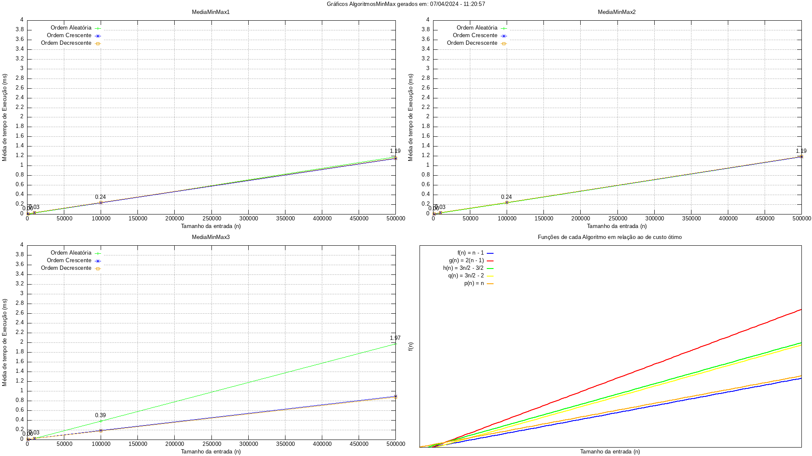

**Fonte**: Autor.

</div>

Como pode ser observado na imagem acima, os gráficos mantêm um mesmo comportamento linear e quase idênticos na maioria dos casos (e isso faz sentido, considerando que todos os algoritmos possue $f(n)$ diferentes por valores constantes). O único caso a se dar maior atenção, é o gráfico de tempo de execução do Algoritmo MinMax3 (Título do Gráfico - MediaMinMax 3) com a disposição aleatória do vetor de entrada. Este resultado gera uma dúvida, pois, se em todos os outros casos, o tempo de execução é mais ou menos o mesmo, por qual razão no MinMax 3 - que também possui um custo ótimo - possui quase o dobro das médias de tempo de execução?*

<div align='center' style='font-size: 11px'>

**Figura 4**: Gráficos de Algoritmos Comparados por Ordem

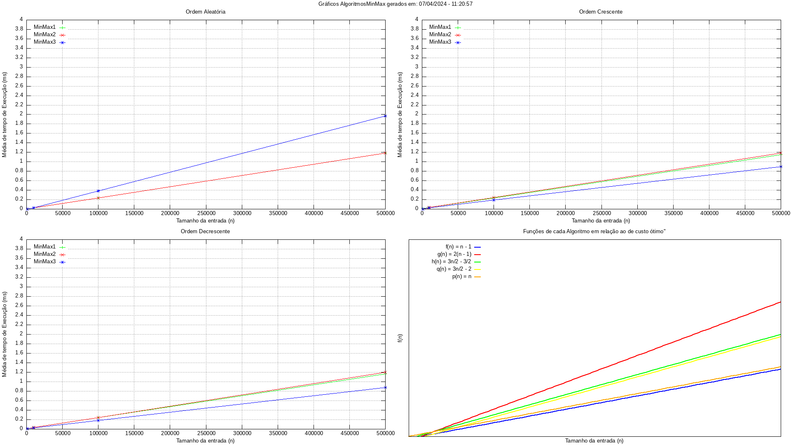

**Fonte**: Autor.

</div>

Analisando o gráfico acima é notável a paridade entre os algoritmos MinMax 1 e 2, que andam praticamente juntos em todas as comparações. O único que se distancia é o MinMax 3, que nas ordens Crescente e Aleatória fica abaixo dos outros dois (mais rápido), e, **curiosamente** fica acima de ambos na ordem Aleatória (mais lento). Novamente algo que não é necessariamente intuitivo de se pensar.*

*A explicação desses resultados será discutida na última [seção](#Interpretação-dos-Resultados-e-Primeiras-Conclusões).

##### 2. Testes no [desktop](#-Ambiente-de-Compilação-e-Execução)

A fim de se confirmar que os resultados encontrados no ambiente padrão de desenvolvimento, compilação e execução (notebook com Ubuntu/compilador gcc), o código também foi testado em um computador desktop com especificações um pouco melhores que o anterior. Além disso, vale ressaltar que neste segundo ambiente, o sistema operacional é o Windows 10 e o compilador é o oficial do Microsoft Visual Studio.

<div align='center' style='font-size: 11px'>

**Figura 5**: Gráficos de Ordens Comparadas por Algoritmo no Desktop

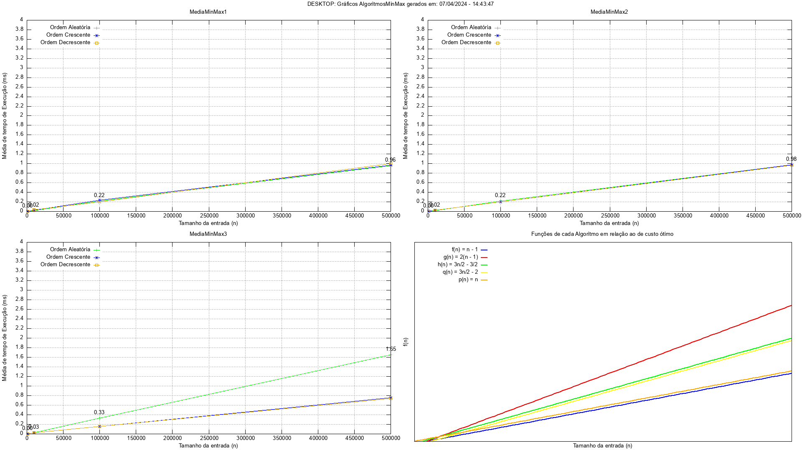

**Fonte**: Autor.

</div>

Nos primeiros gráficos acima, nota-se novamente a paridade da performance de um mesmo algoritmo independentemente da ordem do vetor de entrada. E, novamente, o Algoritmo MinMax 3, com o vetor disposto aleatoriamente, performa muito pior relativamente em relação aos outros. A única diferença em relação aos gráficos da execução padrão é que os valores são relativamente menores, justamente por conta das características dos componentes do computador.

<div align='center' style='font-size: 11px'>

**Figura 6**: Gráficos de Algoritmos Comparados por Ordem no Desktop

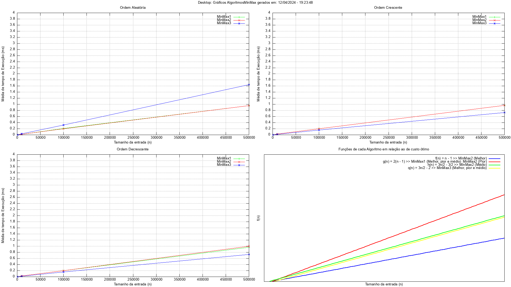

**Fonte**: Autor.

</div>

Na figura acima, percebe-se, mais uma vez, que os algoritmos Minmax 1 e 2 são muito próximos em relação ao tempo de execução, independentemente da ordem do vetor de entrada. Já o Minmax 3 continua performando melhor nas ordens Crescente e Decrescente, e pior na Aleatória. Novamente, relacionando os gráficos acima com os da primeira execução, as médias dos tempos de execução foi menor graças às especificações de _hardware_.

##### 3. Gráfico de Funções de Custo

Por último, mas não menos importante, em cada uma das figuras, o último gráfico não representa necessariamente os tempos de execução dos algoritmos. Mas, indica a ideia de crescimento e o comportamento esperado para cada uma das funções de custo dos Algoritmos Minmax de acordo com seus casos médio, pior e melhor. Vale ressaltar que todos são muito próximos, já que são lineares, então terão resultados não muito distantes entre si.

### Geração do Código no Compilador

Com a dúvida ainda não sanada, decidiu-se realizar testes no [Compiler Explorer](https://godbolt.org). Essa ferramenta é um compilador online que inclui diversos compiladores utilizados mundialmente, e que mostra o código `Assembly` gerado.

##### 1. Padrão

<div align='center' style='font-size: 11px'>

**Figura 7**: Minmax1 compilado para `Assembly`

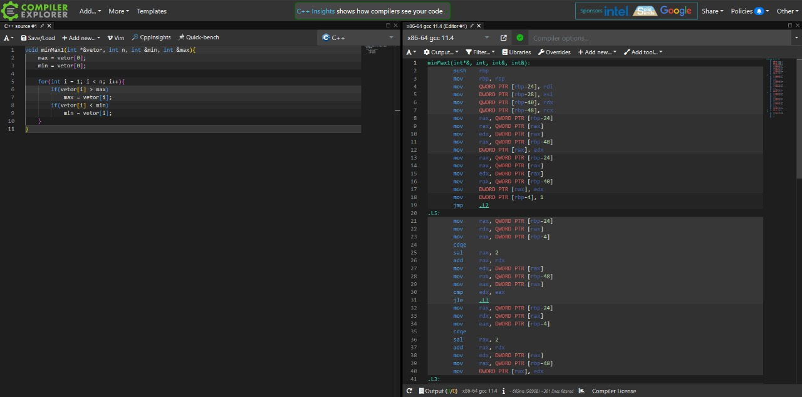

**Figura 8**: Minmax2 compilado para `Assembly`

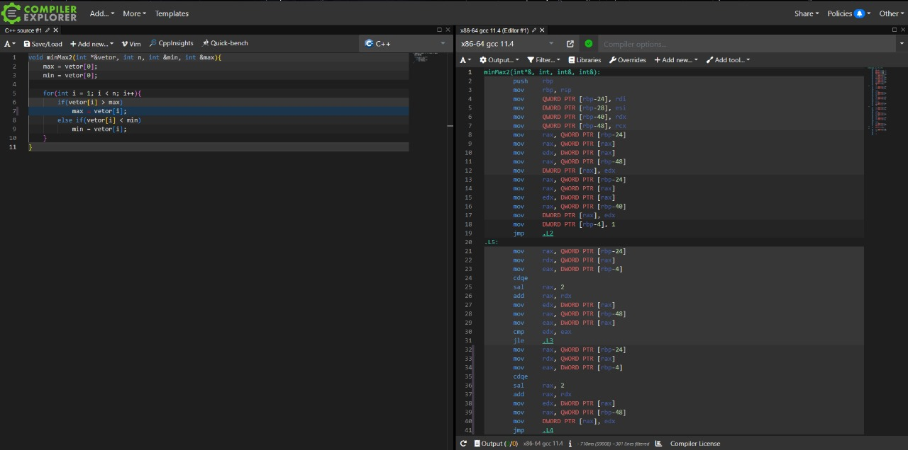

**Figura 9**: Minmax3 compilado para `Assembly`

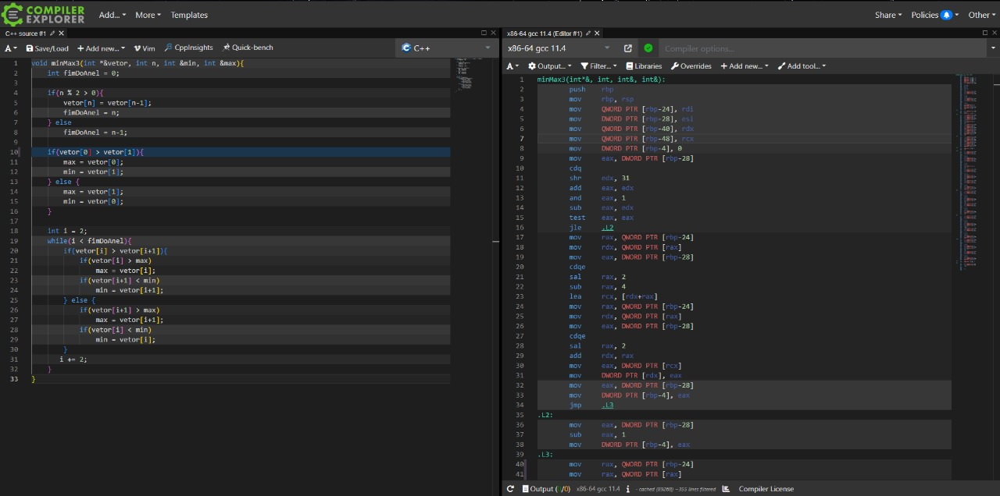

**Fonte**: Autor com Software [Compiler Explorer](https://godbolt.org).

</div>

As três imagens acima mostram o código de cada um dos Algoritmos Minmax testados neste trabalho, compilados a partir do compilador `gcc`, para a linguagem `Assembly`. A quantidade de linhas de cada um nos dá uma ideia de qual pode ser a razão de discrepâncias nos gráficos gerados, pois possuem:

- Minmax 1: **71 linhas**;
- Minmax 2: **72 linhas**;
- Minmax 3: **189 linhas**;

A pequena diferença entre o Minmax 1 e 2 é esperada, já que eles se diferenciam por apenas um `else-if`. Já a quantidade de quase o dobro do Minmax 3 em relação aos anteriores, pode nos dizer alguma coisa. Por mais que em C++ o código também seja pouco mais da metade, precisamos considerar o que isso pode afetar na execução das instruções do processador, considerando as ordenações dos vetores de entrada.

##### 2. Testes com Flag -O3

Por fim, o último teste realizado foi com uma opção ou _flag_ a mais, `-O3`, no comando de compilação do código no `gcc`. Inicialmente, pelo código `Assembly`, nota-se as seguintes alterações no código compilado final:

- Minmax 1: **25 linhas**;
- Minmax 2: **29 linhas**;
- Minmax 3: **74 linhas**;

As diferenças relativas entre elas continuou quase as mesmas, porém, o código do trabalho foi compilado e executado com a opção `-O3` adicionada no início do `makefile`:

<div align='center' style='font-size: 11px'>

**Figura 10**: Adição da _flag_ -O3 no makefile

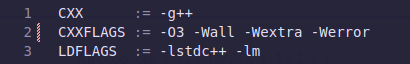

**Fonte**: Autor.

</div>

Ao rodar o `makefile` dessa forma, nota-se uma velocidade superior à padrão. E os gráficos sofreram algumas alterações:

<div align='center' style='font-size: 11px'>

**Figura 11**: Gráficos de Ordens Comparadas por Algoritmo com a _flag_ -O3

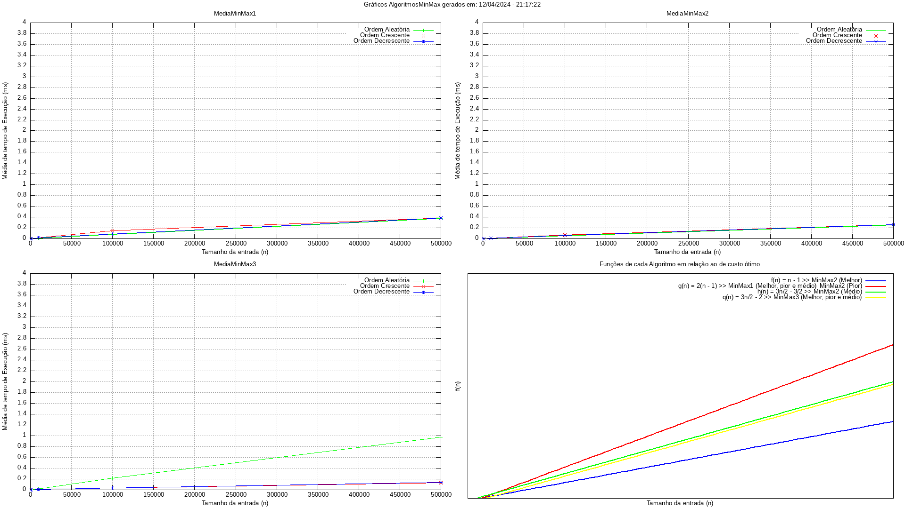

**Fonte**: Autor.

</div>

Os algoritmos por si só abaixaram muito a média de valores de tempo de execução comparados aos anteriores. Porém os gráficos lineares de cada um se mantiveram muito próximos (ordens Aleatória, Crescente e Decrescente). Com exceção, novamente, do Algoritmo Minmax 3 com o vetor de entrada disposto de forma Aleatória, que foi muito maior do que os outros.

<div align='center' style='font-size: 11px'>

**Figura 12**: Gráficos de Algoritmos Comparados por Ordem com a _flag_ -O3

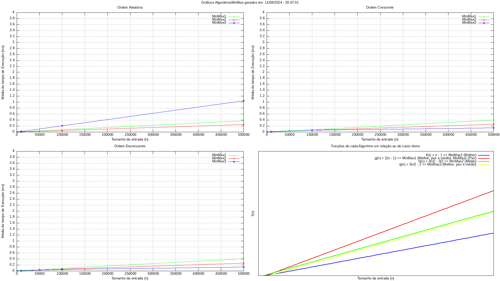

**Fonte**: Autor.

</div>

Agora, os algoritmos quando comparados entre si, tiveram uma diferença maior entre o Minmax 1 e 2, sendo o primeiro um *pouco* mais lento. Isso pode ser explicado pela forma como a _flag_ `-O3` alterou o código final, que pode ter gerado uma instrução que facilita a execução do segundo algoritmo. Porém, ainda há uma diferença entre os dois primeiros e o Minmax 3 no caso de ordem Aleatória. 

### Interpretação dos Resultados e Primeiras Conclusões

A explicação plausível para as discrepâncias visualizadas acima, com foco no Algoritmo Minmax 3 com ordem da entrada Aleatória, seria pela quantidade de estruturas `if` e `else` dentro do `while-loop` do código. Essas estruturas atrapalham o _pipeline_ do processador, que funciona melhor com um código linear, isto é, que acessa a memória por palavrasde bits consecutivas. E, por conta dos desvios condicionais, o processador gasta mais ciclos de operação para realizar essas instruções. Além disso, a ordem do vetor de entrada possui papel crucial nessa visualização e análise gráfica. O fato de o vetor estar ordenado aleatoriamente também "confunde" (ou atrapalha) a implementação no processador de `previsão de desvios`[^9], já que as técnicas dos "preditores" costumam se aproveitar de conceitos lógicos e exatos para tentar prever e não consideram aleatoriedade. 

Uma dessas técnicas consiste na criação de um histórico de desvios condicionais no processador, para serem consultados posteriormente. Porém, como a quantidade da entrada $n$ sempre varia, e pode ser muito alta e sempre com valores distintos, essa técnica cai por água abaixo, pois não há como prever se muitos números aleatórios serão comparados novamente. Segundo Tanembaum (2012, p.312)[^8]:

<div style='font-size: 14px; margin-left: 50px'>

"Se um desvio for previsto corretamente, não há nada de especial a fazer. A execução apenas continua no endereço de destino. O problema começa quando o desvio é previsto de forma errada. Imaginar para onde ir e ir para lá não é difícil. A parte difícil é desfazer as instruções que já foram executadas e não deveriam ter sido."*

</div>
*Versão traduzida.

</div>

<p align="right">(<a href="#readme-topo">voltar ao topo</a>)</p>

## 🏁 Conclusão

<div  align="justify">

O trabalho proposto de se realizar uma análise assintótica das funções de custo dos três Algoritmos Minmax por si só pode não ser capaz de explicar certos comportamentos dos algoritmos com certas massas de dados. Apesar das diferenças notadas entre os valores das médias de tempo de execução de cada um dos algoritmos, eles continuam fazendo parte da mesma classe de problemas (linear - $\mathcal{O}(n)$). Eles, também, não possuem muito custo computacional nem demandam muito tempo de execução, mesmo que o tamanho $n$ da entrada seja muito alto.

Portanto, para se explicar as diferenças ínfimas que existem entre os tempos de execução desses algoritmos, é necessário buscar uma base na implementação de mais baixo nível de _software_ e, principalmente, a nível de _hardware_. Dessa forma, é possível entender o porquê de um algoritmo como o Minmax 3, que possui a menor função de custo na maioria dos casos, pode perder performance em certas situações. Isso ocorre justamente pela complexidade da implementação do código, que foi criada na busca do algoritmo perfeito. Então, considerando uma grande massa de dados $n$ e uma ordem desconhecida desses dados, os algoritmos Minmax 1 e 2 são preferíveis se considerarmos apenas o tempo de execução do programa. Porém, para entradas ordenadas crescente ou decrescentemente, o algoritmo Minmax 3 deve ser considerado.

</div>

<p align="right">(<a href="#readme-topo">voltar ao topo</a>)</p>

## 🔨 Começando

Nesta seção estão exemplificados os meios através dos quais se tornam possíveis a compilação e execução do programa apresentado.

### Pré-requisitos

Inicialmente, algumas considerações importantes sobre como se deve preparar o ambiente para compilar e executar o programa:

> [!NOTE]
> Recomenda-se usar uma distribuição de sistema operacional Linux ou o Windows Subsystem for Linux (WSL), pois os comandos no [`makefile`][makefile] foram selecionados para funcionar em um ambiente [_shell/bash_][bash-url].

Considerando um ambiente _shell_, garanta que os seguintes comandos já foram executados:
  - Atualize os pacotes antes da instalação dos compiladores:
  ```console
  sudo apt update
  ```
  - Instale a coleção de compiladores ___GNU/g++___ e o ___make___:
  ```console
  sudo apt install build-essential
  ```
  - Instale o ___gnuplot___ para a plotagem dos gráficos:
  ```console
  sudo apt-get install gnuplot
  ```
  - Se necessário, instale o ___make___ individualmente:
  ```console
  sudo apt install make
  ```

### Instalando

Com o ambiente preparado, os seguintes passos são para a instalação, compilação e execução do programa localmente:

1. Clone a _branch_ [`AlgoritmosMinMax`][branchAMM-url] do repositório no diretório desejado:
  ```console
  git clone -b AlgoritmosMinMax https://github.com/alvarengazv/trabalhosAEDS1.git
  cd trabalhosAEDS1
  ```
2. Compile o programa com o ___make___, o que gera a pasta `build`, que contém arquivos de objeto e um arquivo executável:
  ```console
  make
  ```
3. Execute o programa da pasta `build` após a compilação:
  ```console
  make run
  ```

4. Se precisar gerar os gráficos separadamente (o programa já faz isso), execute a seguinte linha de comando:
  ```console
  gnuplot src/medias.csv
  ```

5. Se necessário, apague a última compilação da pasta `build`:
  ```console
  make clean
  ```

O programa estará pronto para ser testado.

<p align="right">(<a href="#readme-topo">voltar ao topo</a>)</p>

## 🧪 Ambiente de Compilação e Execução

> [!IMPORTANT] 
> Para que os testes tenham validade, considere as especificações técnicas dos computadores utilizados

O trabalho foi desenvolvido, compilado e executado em dois ambiente distintos, cada um com as configurações especificadas em cada quadro:

<div align='center'>

![Ubuntu][ubuntu-badge]
![Ryzen][ryzen5500-badge]
![Lenovo][lenovo-badge]

SO | Compilador | CPU | RAM | Dispositivo de Armazenamento 
--- | --- | --- | --- | ---
Ubuntu 22.04.4 LTS | g++ (Ubuntu 11.4.0-1ubuntu1~22.04) 11.4.0 | Ryzen 5 5500U 2.1GHz | 2x4GB 3200MHz | SSD M.2 NVME 256GB (3500MB/s de Leitura x 1200MB/s de Escrita) 

</div>

<div align='center'>

![Windows][windows-badge]
![Ryzen][ryzen3500-badge]

SO | Compilador | CPU | RAM | Dispositivo de Armazenamento 
--- | --- | --- | --- | ---
Windows 10 - Version 22H2 - OS Build 19045.4170 | Microsoft (R) C/C++ Optimizing Compiler Version 19.39.33523 for x86 | Ryzen 5 3500X 4.05GHz | 2x8GB 3200MHz | SSD M.2 NVME 256 GB (3500MB/s de Leitura x 1200MB/s de Escrita) 

</div>

<p align="right">(<a href="#readme-topo">voltar ao topo</a>)</p>

## 📚 Referências

BRUNET, J. A. Ordenação por Comparação: Quick Sort. **Github.io**. 2019. Disponível em: https://joaoarthurbm.github.io/eda/posts/quick-sort/. Acesso em: 10 abr. 2024.

C++ Reference. **CPPReference**, 2017. Disponível em: https://en.cppreference.com/w/cpp. Acesso em: 10 abr. 2024.

CORMEN, T. H; LEISERSON C. E; RIVEST R. L; STEIN C. **Algoritmos**: Teoria e Prática. Tradução: Arlete S. Marques. 3. Ed. Rio de Janeiro: ELSEVIER, 2012.

How branches influence the performance of your code and what can you do about it?. **Johnny’s Software Lab LLC**. 2020. Disponível em: https://johnnysswlab.com/how-branches-influence-the-performance-of-your-code-and-what-can-you-do-about-it/. Acesso em: 10 abr. 2024.

Individual option description: -O, -qoptimize. **IBM**. 2021. Disponível em: https://www.ibm.com/docs/en/xl-c-aix/13.1.3?topic=descriptions-qoptimize. Acesso em: 11 abr. 2024.

Official gnuplot documentation. **gnuplot**, 2022. Disponível em: http://www.gnuplot.info/documentation.html. Acesso em: 10 abr. 2024.

Pipes em C - Comunicação entre Processos (IPC - Interprocess Communication). **Programação Progressiva**, 2017. Disponível em: https://www.programacaoprogressiva.net/2014/09/Pipes-em-C-Comunicao-entre-Processos-IPC-Interprocess-Communication.html. Acesso em: 10 abr. 2024.

Simple script file. **RIP Tutorial**, 2016. Disponível em: https://riptutorial.com/gnuplot/example/14015/simple-script-file. Acesso em: 10 abr. 2024.

TANENBAUM, A. S.; AUSTIN, T. **Structured Computer Organization**. [S.l.], 2012. 800 p.

Why Was 1 January 1970 Used as the Epoch Time?. **Baeldung**, 2024. Disponível em: https://www.baeldung.com/linux/epoch-time. Acesso em: 10 abr. 2024.

ZIVIANI, N. **Projeto de Algoritmos com Implementações em Java e C++**. [S.l.] 1. Ed. Cengage Learning, 2006.

<p align="right">(<a href="#readme-topo">voltar ao topo</a>)</p>

## 📨 Contato

<div align="center">
   <i>Guilherme Alvarenga de Azevedo - Graduando - 3º Período de Engenharia de Computação @ CEFET-MG</i>
<br><br>

[![Gmail][gmail-badge]][gmail-autor]
[![Linkedin][linkedin-badge]][linkedin-autor]
[![Telegram][telegram-badge]][telegram-autor]
</div>

<p align="right">(<a href="#readme-topo">voltar ao topo</a>)</p>

[^1]: ZIVIANI, N. **Projeto de Algoritmos com Implementações em Java e C++**. 1. Ed. Cengage Learning, 2006.

[^2]: CORMEN, T. H; LEISERSON C. E; RIVEST R. L; STEIN C. **Algoritmos**: Teoria e Prática. Tradução: Arlete S. Marques. 3. Ed. Rio de Janeiro: ELSEVIER, 2012. 

[^3]: C++ Reference. **CPPReference**, 2017. Disponível em: https://en.cppreference.com/w/cpp. Acesso em: 10 abr. 2024.

[^4]: Simple script file. **RIP Tutorial**, 2016. Disponível em: https://riptutorial.com/gnuplot/example/14015/simple-script-file. Acesso em: 10 abr. 2024.

[^5]: Why Was 1 January 1970 Used as the Epoch Time?. **Baeldung**, 2024. Disponível em: https://www.baeldung.com/linux/epoch-time. Acesso em: 10 abr. 2024.

[^6]: Pipes em C - Comunicação entre Processos (IPC - Interprocess Communication). **Programação Progressiva**, 2017. Disponível em: https://www.programacaoprogressiva.net/2014/09/Pipes-em-C-Comunicao-entre-Processos-IPC-Interprocess-Communication.html. Acesso em: 10 abr. 2024.

[^7]: BRUNET, J. A. Ordenação por Comparação: Quick Sort. **Github.io**. 2019. Disponível em: https://joaoarthurbm.github.io/eda/posts/quick-sort/. Acesso em: 10 abr. 2024.

[^8]: TANENBAUM, A. S.; AUSTIN, T. **Structured Computer Organization**. [S.l.], 2012. 800 p.

[^9]: How branches influence the performance of your code and what can you do about it?. **Johnny’s Software Lab LLC**. 2020. Disponível em: https://johnnysswlab.com/how-branches-influence-the-performance-of-your-code-and-what-can-you-do-about-it/. Acesso em: 11 abr. 2024.

[^10]: Individual option description: -O, -qoptimize. **IBM**. 2021. Disponível em: https://www.ibm.com/docs/en/xl-c-aix/13.1.3?topic=descriptions-qoptimize. Acesso em: 11 abr. 2024.

[vscode-badge]: https://img.shields.io/badge/Visual%20Studio%20Code-0078d7.svg?style=for-the-badge&logo=visual-studio-code&logoColor=white
[vscode-url]: https://code.visualstudio.com/docs/?dv=linux64_deb
[make-badge]: https://img.shields.io/badge/_-MAKEFILE-427819.svg?style=for-the-badge
[make-url]: https://www.gnu.org/software/make/manual/make.html
[cpp-badge]: https://img.shields.io/badge/c++-%2300599C.svg?style=for-the-badge&logo=c%2B%2B&logoColor=white
[cpp-url]: https://en.cppreference.com/w/cpp
[trabalho-url]: https://drive.google.com/file/d/1m3pVwTmCQPWp7HDzCqwcy_aB0x4A3yIx/view?usp=sharing
[github-prof]: https://github.com/mpiress
[medias-ref]: output/csv/medias.csv
[mediasFlag-ref]: output/csv/mediasComFlag.csv
[mediasPC-ref]: output/csv/mediasPC.csv
[graficoAO-ref]: output/img/graficoComparacaoAlgoritmosPorOrdem.png
[graficoOA-ref]: output/img/graficoComparacaoOrdensPorAlgoritmo.png
[graficoAOFlag-ref]: output/img/graficoComparacaoAlgoritmosPorOrdemComFlag.png
[graficoOAFlag-ref]: output/img/graficoComparacaoOrdensPorAlgoritmoComFlag.png
[graficoAOPC-ref]: output/img/graficoComparacaoAlgoritmosPorOrdemPC.png
[graficoOAPC-ref]: output/img/graficoComparacaoOrdensPorAlgoritmoPC.png
[main-ref]: src/main.cpp
[hppAMM-ref]: src/minMax.hpp
[cppAMM-ref]: src/minMax.cpp
[gnuAMM-ref]: src/mediasMinMax.p
[branchAMM-url]: https://github.com/alvarengazv/trabalhosAEDS1/tree/AlgoritmosMinMax
[makefile]: ./makefile
[bash-url]: https://www.hostgator.com.br/blog/o-que-e-bash/
[lenovo-badge]: https://img.shields.io/badge/lenovo%20laptop-E2231A?style=for-the-badge&logo=lenovo&logoColor=white
[ubuntu-badge]: https://img.shields.io/badge/Ubuntu-E95420?style=for-the-badge&logo=ubuntu&logoColor=white
[ryzen5500-badge]: https://img.shields.io/badge/AMD%20Ryzen_5_5500U-ED1C24?style=for-the-badge&logo=amd&logoColor=white
[ryzen3500-badge]: https://img.shields.io/badge/AMD%20Ryzen_5_3500X-ED1C24?style=for-the-badge&logo=amd&logoColor=white
[windows-badge]: https://img.shields.io/badge/Windows-0078D6?style=for-the-badge&logo=windows&logoColor=white
[linkedin-badge]: https://img.shields.io/badge/-LinkedIn-0077B5?style=for-the-badge&logo=Linkedin&logoColor=white
[linkedin-autor]: https://www.linkedin.com/in/guilherme-alvarenga-de-azevedo-959474201/
[telegram-badge]: https://img.shields.io/badge/Telegram-2CA5E0?style=for-the-badge&logo=telegram&logoColor=white
[telegram-autor]: https://t.me/alvarengazv
[gmail-badge]: https://img.shields.io/badge/-Gmail-D14836?style=for-the-badge&logo=Gmail&logoColor=white
[gmail-autor]: mailto:gui.alvarengas234@gmail.com
[tupla-url]: https://www.ic.unicamp.br/~raquel.cabral/pdf/Aula15.pdf